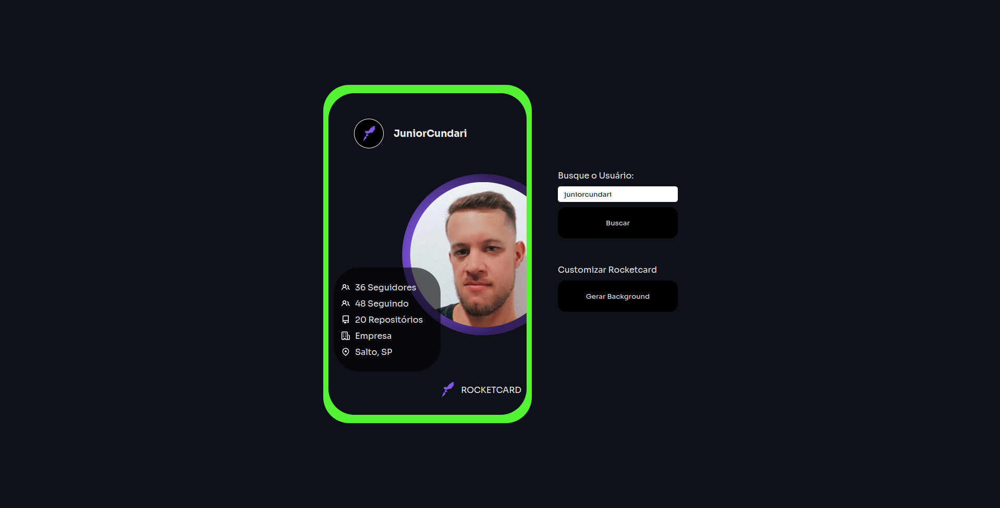

# Rocket Card
Project created for studies.

This page is basically a card that creates a random background and searches the GitHub API and returns the user's information.
## Access the project: [Link Here!](https://rocket-card-github.vercel.app/).

 

-----------

## Layout

This layout was created for [Rocketseat](https://github.com/rocketseat-education).

On layout [Figma](https://www.figma.com/file/LeeBh2lr3LX11YhfKOnzVp/DD-%2F-Rocketcard-(Copy)?node-id=3%3A2).

Guide for creating this project! [Notion](https://efficient-sloth-d85.notion.site/Desafio-Rocketcard-0d3572ef941f4a88889191773fe61c44).

## Getting Started with Create React App

This project was bootstrapped with [Create React App](https://github.com/facebook/create-react-app).

## Available Scripts

In the project directory, you can run:

### `yarn start`

Runs the app in the development mode.\
Open [http://localhost:3000](http://localhost:3000) to view it in your browser.

The page will reload when you make changes.\
You may also see any lint errors in the console.

